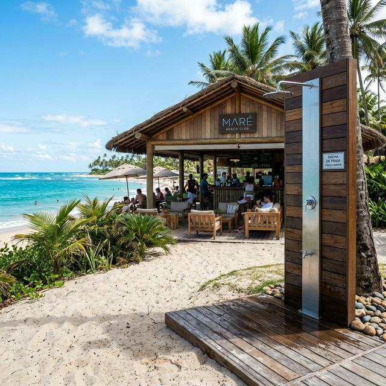
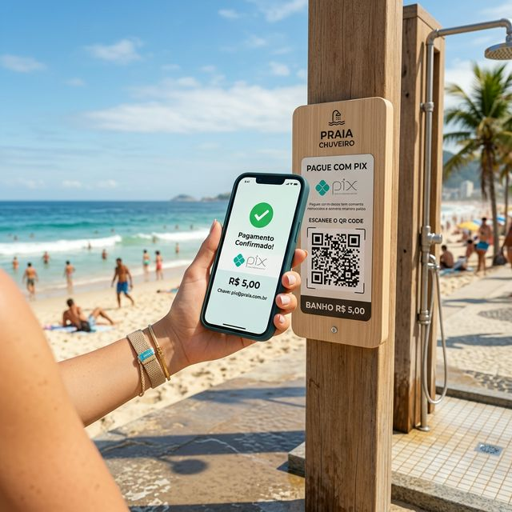
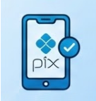
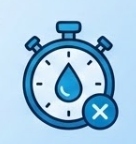
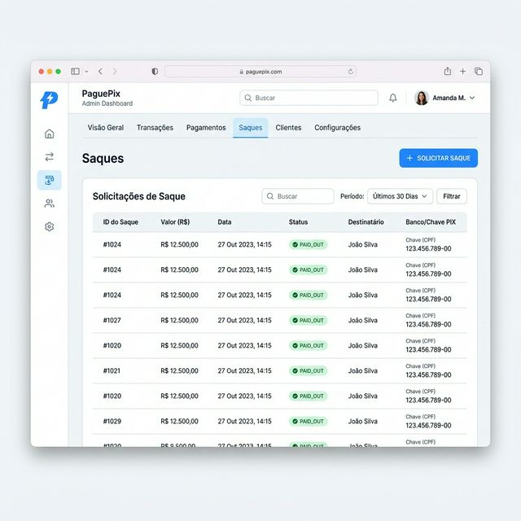
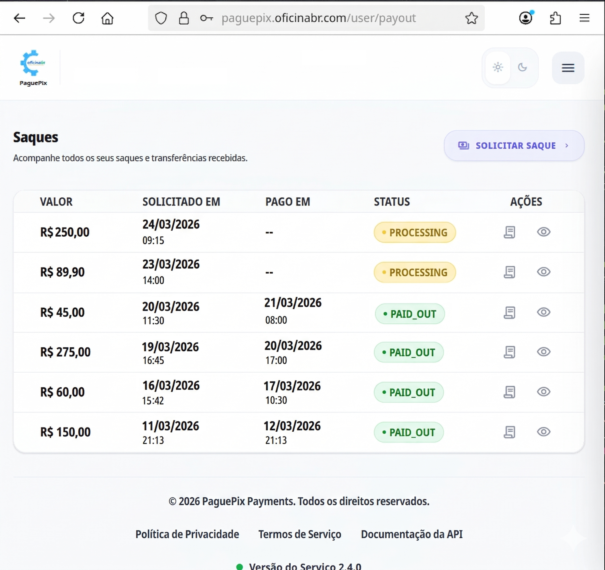

# SmartShower
## IoT e Sustentabilidade no Litoral
**Transformando Desperdício de Água em Receita Recorrente**

Programa de Fomento **PRAIA** • Instituto Atlântico (Fortaleza - CE)

*   **Apresentador:** Aroldo Costa
*   **Contato:** (85) 99135-1205 | aroldocosta@yahoo.com.br

  

---

# O Problema: O Ralo Invisível do Litoral
### O impacto financeiro e socioambiental do desperdício de água potável.

<table border="0" width="100%" cellpadding="5" cellspacing="0">
  <tr>
    <td width="60%" valign="top">
      <ul>
        <li><strong>Desperdício Crônico:</strong> Chuveiros de praia comuns operam sem controle de vazão ou tempo. Um banhista consome em média <strong>12 litros de água potável por minuto</strong>.</li>
        <li><strong>Custo Financeiro Silencioso:</strong> Torneiras abertas ou uso abusivo geram prejuízo estimado em <strong>R$ 450+ mensais por chuveiro</strong> para as barracas.</li>
        <li><strong>Crise Hídrica:</strong> O Ceará é uma região semiárida. Desperdiçar água potável no litoral é um grave problema socioambiental (anti-ESG).</li>
        <li><strong>Sem Gestão:</strong> Os proprietários operam no escuro, sem dados sobre o consumo de água ou a utilização real dos chuveiros.</li>
      </ul>
    </td>
    <td width="40%" align="center" valign="middle">
      
       
      Chuveiros sem controle representam prejuízo invisível.
    </td>
  </tr>
</table>

---

# A Solução: Chuveirada Inteligente B2B2C
### Automatização que se paga, gera receita e preserva recursos escassos.

<table border="0" width="100%" cellpadding="5" cellspacing="0">
  <tr>
    <td width="60%" valign="top">
      <ul>
        <li><strong>Controle de Fluxo IoT:</strong> Uma válvula solenoide conectada controla digitalmente a liberação e corte da água.</li>
        <li><strong>Ativação Simplificada via Pix:</strong> O usuário lê o QR Code no ponto de banho, efetua o Pix (ex: R$ 2,50) e a liberação ocorre em segundos.</li>
        <li><strong>Timer Inteligente:</strong> O sistema interrompe o fluxo automaticamente ao final do tempo contratado (ex: 1 minuto), eliminando desperdícios.</li>
        <li><strong>Modelo Ganha-Ganha:</strong> O dono da barraca elimina custos fixos de água desperdiçada e cria uma nova fonte de lucro passivo recorrente.</li>
      </ul>
    </td>
    <td width="40%" align="center" valign="middle">
      
       
      Pagamento rápido via Pix direto do smartphone.
    </td>
  </tr>
</table>

---

# Como Funciona (A Experiência do Cliente)
### Quatro passos simples do escaneamento ao banho automático.

<table border="0" width="100%" cellpadding="5" cellspacing="0">
  <tr>
    <td width="23%" align="center" valign="top" style="background: #f8fafc; border-radius: 8px; border: 1px solid #e2e8f0; padding: 10px;">
      
       <strong>1. Escaneia</strong>
       Banhista escaneia o QR Code visível no chuveiro.
    </td>
    <td width="2%" style="border:none;"></td>
    <td width="23%" align="center" valign="top" style="background: #f8fafc; border-radius: 8px; border: 1px solid #e2e8f0; padding: 10px;">
      
       <strong>2. Paga</strong>
       Realiza o pagamento instantâneo via Pix.
    </td>
    <td width="2%" style="border:none;"></td>
    <td width="23%" align="center" valign="top" style="background: #f8fafc; border-radius: 8px; border: 1px solid #e2e8f0; padding: 10px;">
      
       <strong>3. Libera</strong>
       A chuveirada é destravada via hardware local.
    </td>
    <td width="2%" style="border:none;"></td>
    <td width="23%" align="center" valign="top" style="background: #f8fafc; border-radius: 8px; border: 1px solid #e2e8f0; padding: 10px;">
      
       <strong>4. Encerra</strong>
       O timer desliga o fluxo ao final do tempo contratado.
    </td>
  </tr>
</table>

---

# O Mercado Litorâneo do Nordeste
### Um mercado massivo, concentrado e pronto para a digitalização.

*   **TAM (Mercado Total):** **~50.000 chuveiros** em praias urbanas, clubes de lazer e parques aquáticos no Brasil.
*   **SAM (Mercado Endereçável):** **~10.000 chuveiros** de barracas de praia e hotéis na Região Nordeste.
*   **SOM (Mercado Foco Inicial):** **300 a 500 chuveiros** em Fortaleza e Região Metropolitana (Praia do Futuro, Cumbuco, Porto das Dunas) nos primeiros 18 meses.

> **Diferencial de Fortaleza:** A Praia do Futuro possui uma das maiores e mais estruturadas redes de barracas de praia do mundo, funcionando 365 dias por ano sob intenso fluxo de turistas locais e internacionais.

---

# Modelo de Negócios & ROI do Parceiro
### A matemática clara que convence o dono da barraca de praia.

*   **Preço do Banho (1 min):** R$ 2,50 (com vazão média de 12 litros).
*   **Custos Operacionais:** Tarifa de água (R$ 35,75/m³ + esgoto) + Taxas de transação/split.

| Métrica Financeira (1 Chuveiro) | Valor |
| :--- | :--- |
| **Receita Mensal Bruta (10 banhos/dia)** | R$ 750,00 |
| (-) Custo da Água Consumida | R$ 128,70 |
| (-) Taxas de Transação & Split | R$ 195,00 |
| **Lucro Líquido Mensal da Barraca** | **R$ 426,30** |

*   **Monetização da Startup:** Comissão de transação por banho + taxa de licenciamento e manutenção mensal do hardware (pago pelo excedente do ROI).

---

# Go-To-Market & Tração: Risco Zero
### Como conquistaremos os primeiros clientes na Praia do Futuro.

*   **Programa de Parceiros Fundadores:** Seleção das primeiras **5 barracas pioneiras** para a fase inicial de testes em campo.
*   **Capex Inicial por nossa conta:** Instalação e hardware gratuitos para os pilotos.
*   **Garantia de 30 Dias:** Se após 30 dias o proprietário não perceber aumento na lucratividade hídrica ou não aprovar o sistema, retiramos o equipamento sem custo.
*   **Objetivos Estratégicos:**
    1.  Testar o hardware em condições reais de intempéries (salinidade extrema).
    2.  Coletar dados de conversão de banhistas para validar o modelo de ROI.
    3.  Criar os primeiros cases de sucesso locais para apoiar a expansão comercial.

---

# Diferenciais Competitivos (Moat)
### Tecnologia focada na facilidade operacional e durabilidade.

<table border="0" width="100%" cellpadding="5" cellspacing="0">
  <tr>
    <td width="60%" valign="top">
      <ul>
        <li><strong>Instalação Modular Externa:</strong> Sem necessidade de quebrar paredes ou fazer reformas hidráulicas complexas. Instalação limpa em menos de 2 horas.</li>
        <li><strong>Resistência Litorânea Extrema:</strong> Gabinete anticorrosivo projetado para resistir à umidade, maresia severa e calor do Nordeste.</li>
        <li><strong>Gestão Transparente:</strong> Dashboard financeiro com split automático e histórico rastreável em tempo real.</li>
        <li><strong>Segurança Anti-Fraude:</strong> Comunicação criptografada que impede ativação física do chuveiro sem pagamento compensado.</li>
      </ul>
    </td>
    <td width="40%" align="center" valign="middle">
      
       
      Dashboard intuitivo para o controle na palma da mão.
    </td>
  </tr>
</table>

---

# Sinergia com o Instituto Atlântico (Programa PRAIA)
### Aceleração tecnológica para suprir nosso gap de hardware.

*   **Nosso Gap Técnico:** O time tem forte competência em desenvolvimento de software (Java, Angular, Postgres) e gestão, mas carece de expertise em engenharia industrial de hardware.
*   **Como o Atlântico nos Acelera:**
    1.  **Engenharia de Hardware:** Projetar e homologar a placa comercial (PCB layout) com alta eficiência energética e baixo custo.
    2.  **Laboratório de Maresia:** Apoio no teste de materiais e invólucros para garantir durabilidade contra corrosão galvânica.
    3.  **Certificação Anatel:** Mentoria para homologação de conectividade sem fio.
*   **Fit ESG (PRAIA Impacta):** Alinhamento direto com metas de sustentabilidade ao diminuir o desperdício de água potável no semiárido cearense.

---

# O Time & Visão de Futuro
### Estrutura técnica e comercial pronta para escalar.

<table border="0" width="100%" cellpadding="5" cellspacing="0">
  <tr>
    <td width="60%" valign="top">
      <ul>
        <li><strong>Aroldo Costa (Fundador):</strong> Visão de negócios, relacionamento comercial B2B com barracas locais e coordenação do projeto.</li>
        <li><strong>Time de Tecnologia (Software):</strong> 1 Dev Full-Stack (Java, Postgres, Angular) e 1 Dev Front-End, garantindo robustez de APIs e dashboard.</li>
        <li><strong>Time Administrativo & Operacional:</strong> 3 profissionais focados em suporte ao cliente, expansão comercial nas praias e logística de instalação.</li>
        <li><strong>Meta:</strong> Alcançar 200 chuveiros conectados até o final de 2027.</li>
      </ul>
    </td>
    <td width="40%" align="center" valign="middle">
      
       
      Repasse Pix testado e integrado.
    </td>
  </tr>
</table>
